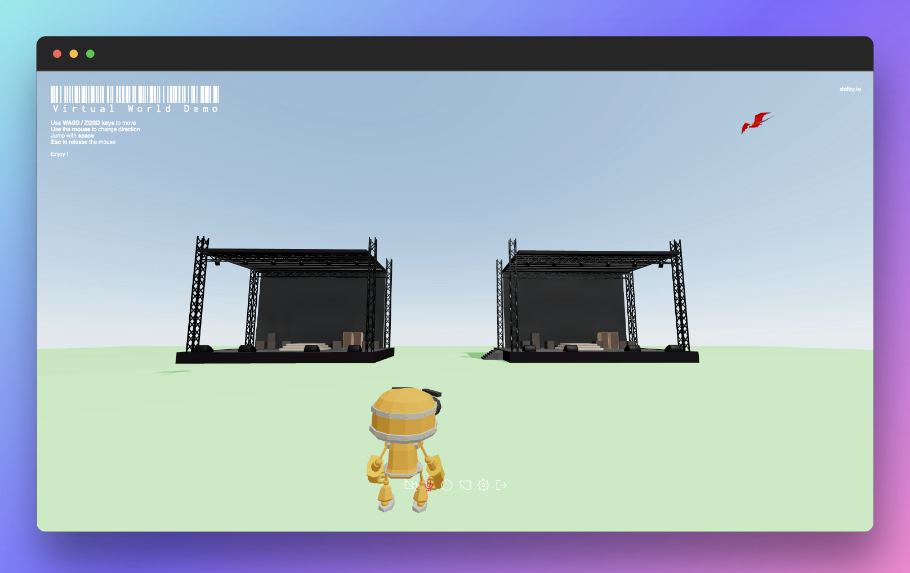

<div align="center">
    
</div>

<div align="center" style="margin-top: 20px">
    <a href="https://app.netlify.com/sites/comms-web-demo/deploys"></a>
</div>

# Dolby.io Virtual World Web Application Demo

> Discover an immersive spatial audio experience through a web application showcasing the Dolby.io Communications API's 
> capabilities on a browser.



## Features

* Create and join a spatial conference / event,
* Navigate in a 3d environment,
* Interact with remote participants in a 3d world,
* Use video capabilities (device selection, broadcast video, ...),
* Use audio capabilities (device selection, toggle local audio, ...),
* Share your screen,
* More to come...

## Requirements
[]() []()

* A valid [Dolby.io account](https://dolby.io/) (CPaaS - add voice and video to the application),
* A valid [PubNub account](https://www.pubnub.com/) (Real-Time communication platform - 3D locations synchronisation).

## Setup

Clone this repository to your desktop: 

```bash
git clone https://github.com/dolbyio-samples/comms-web-demo.git
```

After cloning this repository, go to its root directory and run the following command to install all the dependencies

```bash
cd comms-web-demo
npm install
```

## Environment settings

Once the dependencies are installed, create a .env file at the root of this project.
Edit it as follow: 

```bash
VITE_CLIENT_ACCESS_TOKEN=[CLIENT_ACCESS_TOKEN]      # your client access token, retrieved from Dolby.io (if you don't have a valid authentication server).
                                                    # note: this token will be valid only 12h and refresh token mechanism will not work.
#or                                                    
VITE_AUTH_URL=[AUTH_URL]                            # your own authentication server url

VITE_PUBNUB_PUBLISHER_KEY=[PUBNUB_PUBLISHER_KEY]    # PubNub publisher application key
VITE_PUBNUB_SUBSCRIBER_KEY=[PUBNUB_SUBSCRIBER_KEY]  # PubNub subscriber application key   
```

## Usage

### Debug

Once the dependencies are installed, you can run the following command to start the application in development mode: 

```bash
npm run dev
```
Then, you will able to access it at  http://127.0.0.1:5173/


### Production

If you want to build the application instead, run the following script:

```bash
npm run build
```

Once done, an application built in production mode, could be served as follows :

```bash
npm install --global serve    # if not already installed
serve ./dist
```

### Testing

To run unit tests, run one of the following commands: 

Watch mode: 
```bash
npm run test   
```

Coverage:
```bash
npm run coverage  
```

## References

* [react](https://fr.reactjs.org/) (user interfaces)
* [react three fiber](https://docs.pmnd.rs/react-three-fiber/getting-started/introduction) ( react renderer for Three.js)
* [drei](https://github.com/pmndrs/drei) (helpers for react-three-fiber)
* [react three rapier](https://github.com/pmndrs/react-three-rapier) (physics engine)
* [three.js](https://threejs.org/) (3D library)
* [redux](https://redux.js.org/) (state management)
* [redux-saga](https://redux-saga.js.org/) (side effect management)
* [Vite](https://vitejs.dev/) (frontend tooling)
* [Vitetest](https://vitest.dev/) (blazing fast unit test framework)
* [Prettier](https://prettier.io/) (code formatter)


## License

[](https://opensource.org/licenses/MIT)

Copyright (c) 2023 Dolby.io

Permission is hereby granted, free of charge, to any person obtaining a copy
of this software and associated documentation files (the "Software"), to deal
in the Software without restriction, including without limitation the rights
to use, copy, modify, merge, publish, distribute, sublicense, and/or sell
copies of the Software, and to permit persons to whom the Software is
furnished to do so, subject to the following conditions:

The above copyright notice and this permission notice shall be included in all
copies or substantial portions of the Software.

THE SOFTWARE IS PROVIDED "AS IS", WITHOUT WARRANTY OF ANY KIND, EXPRESS OR
IMPLIED, INCLUDING BUT NOT LIMITED TO THE WARRANTIES OF MERCHANTABILITY,
FITNESS FOR A PARTICULAR PURPOSE AND NONINFRINGEMENT. IN NO EVENT SHALL THE
AUTHORS OR COPYRIGHT HOLDERS BE LIABLE FOR ANY CLAIM, DAMAGES OR OTHER
LIABILITY, WHETHER IN AN ACTION OF CONTRACT, TORT OR OTHERWISE, ARISING FROM,
OUT OF OR IN CONNECTION WITH THE SOFTWARE OR THE USE OR OTHER DEALINGS IN THE
SOFTWARE.


